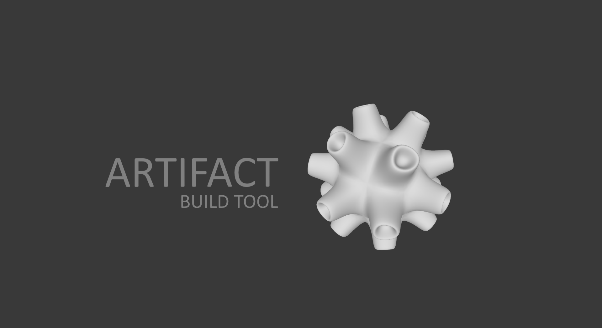
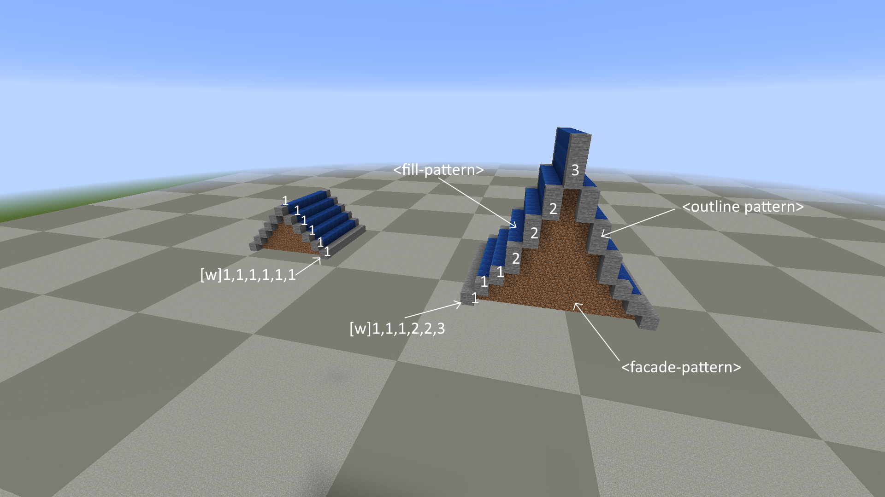
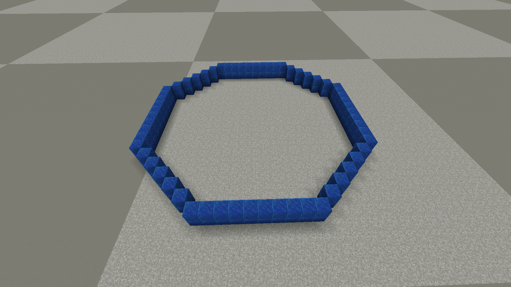
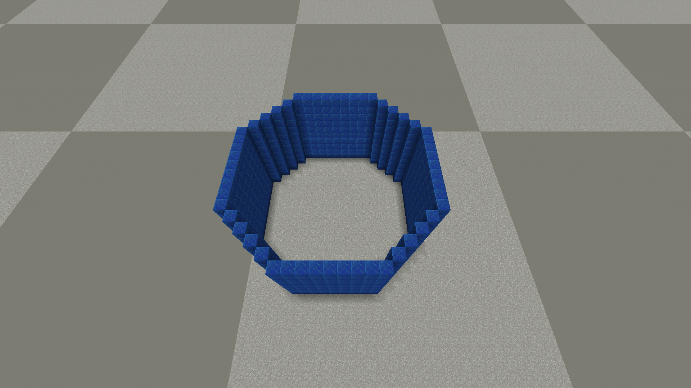
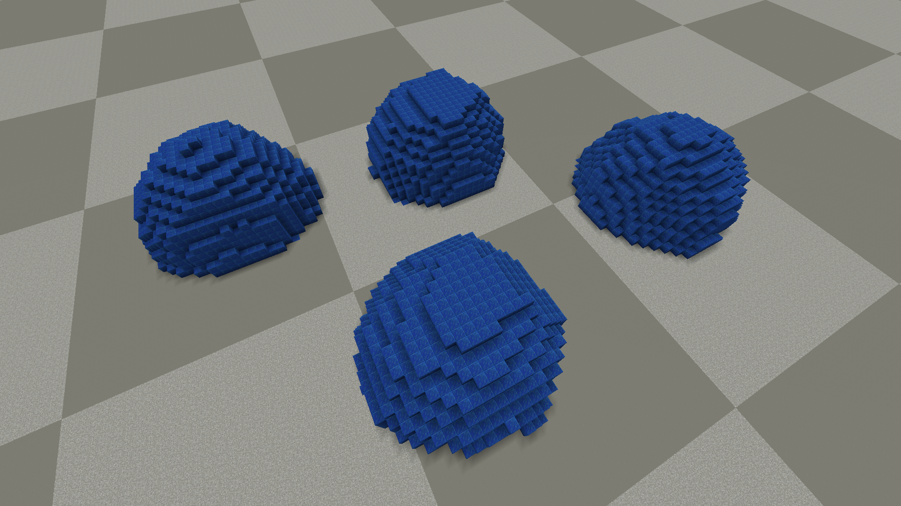
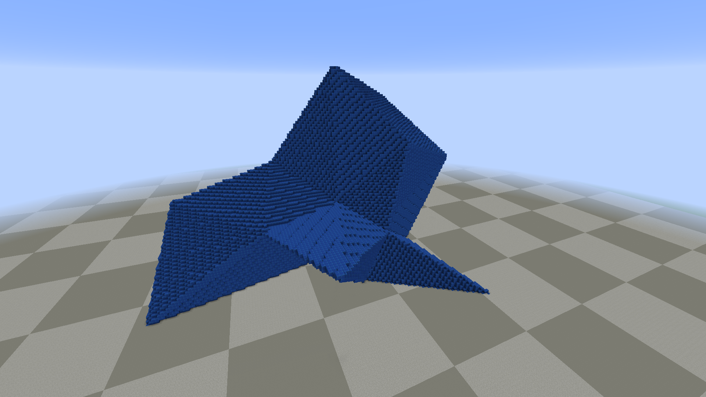
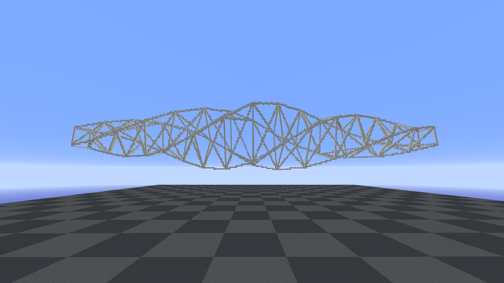
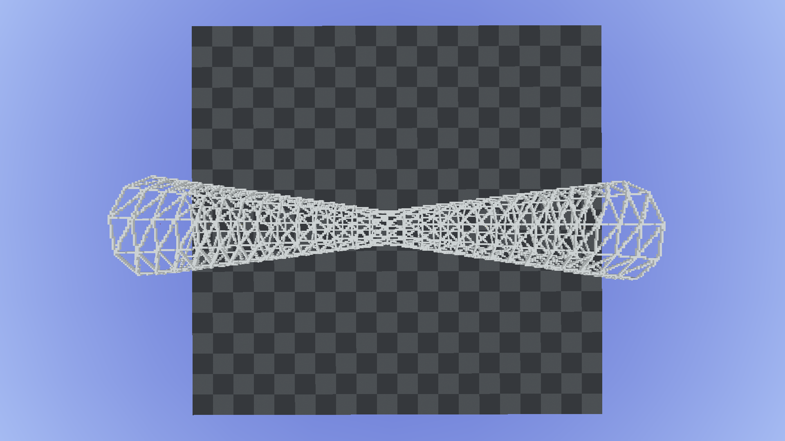
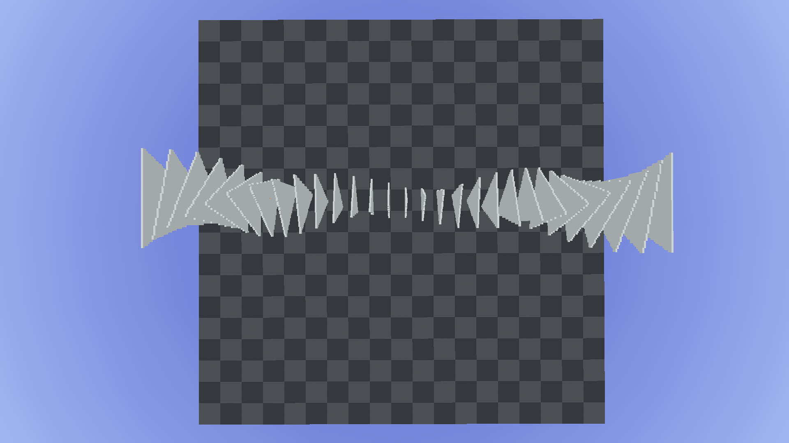
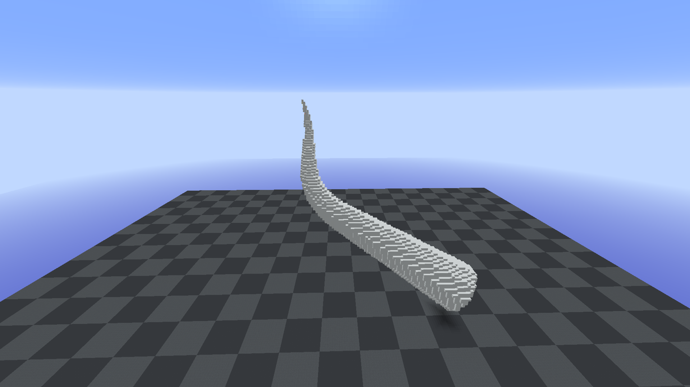

# Artifact Build Tool Documentation

### Artifact Syntax

`<>` required argument  
`[]` optional argument (flag)  
`[][]` an array argument with values separated by commas like w20,10,5  
`pattern` a WorldEdit or Fawe pattern like `50%air`, `50%1`, `#simplex[10][3,3:1,1]` or just a single block id  

---

### Unbind Tool Command

###### Syntax:
`/art none`

###### Desc:
Unbinds the currently binded tool.

---

### Roof Command

###### Syntax:
`/art roof <fill-pattern> <outline-pattern> <facade-pattern>`

###### Desc:
Creates a roof based on specified parameters.

###### Parameters:
`<fill-pattern>` - the main material for the roof  
`<outline-pattern>` - the material for the outline of the roof  
`<facade-pattern>` - the material for the facade part (gable side) of the roof  

`[w][]` *widths* - angles / widths defining the base roof shape  
`[s]` *stack* - defines the size of the ridge  
`[inset]` *inset* - defines the size of the overhang (inset on the gable side)  

###### Examples:

`/art roof 22 1 3 w1,1,1,1,1,1 s10 inset 1`

`/art roof 22 1 3 w1,1,1,2,2,2,3 s10 inset1`

---

### Octagon Command

###### Syntax:
`/art oct <size> <height> <pattern>`

###### Desc:
Creates an octagonal shape with the specified size and height.

###### Parameters:

`<size>` - specifies the length of the straight sides in blocks
`<height>` - specifies the number of layers along the y-axis in blocks
`<pattern>` - the material for the shape

###### Examples:

`/art oct 10 2 22`

`/art oct 9 10 22`

---

### Rock Command

###### Syntax:
`/art rock <pattern>`

###### Alias:
`/art r <pattern>`

###### Desc:
Binds a rock brush tool to the current item in the main hand.

###### Flags:
`[dim][]` *dimension* - the base dimension of the rock to create  
`[s]` *subdivisions* - the smoothness of the rock to create  
`[rngMin]` *range minimum* - the minimum of the used noise range  
`[rngMax]` *range maximum* - the maximum of the used noise range  
`[wf]` *wireframe* - creates the shape as wireframe  
`[hollow]` *hollow* - leaves the shape hollow inside  
`[shape]` *shape* - NOT USED  
`[rx]` *horizontal rotation* - the rotation along the x axis  
`[ry]` *vertical rotation* - the rotation along the y axis  
`[yoff]` *y-offset* - offset along the y-axis  
`[type]` *type* - the type of shape created (experimental)  

To unbind the tool use:
`/art none`

type parameters:
* 0 - default base rock
* 1 - octahedron based shape  
* 2 - pyramid based shape
* 3 - mushroom shape

###### Examples:

`/art rock 22`

`/art rock 22 rngMin0.1 rngMax4`

---

### Pipe Command

###### Syntax:
`/art pipe <pattern>`

###### Alias:
`/art p <pattern>`

###### Desc:
Extrudes a circular shape along the current curve.

###### Flags:
`[w][]` *width* - defines one or more widths separated by comma  
`[r][]` *rotation* - defines one or more rotations (in degrees) separated by comma  
`[wf]` *wireframe* - extrudes the shape as wireframe model  
`[h]` *hollow* - extrudes the shape as hollow body  
`[points]` *points* - places only the edge points of the extruded shape  
`[res]` *resolution* - determines the resolution of the current curve (distance between the segments)  
`[rs]` *rotation segments* - determines the number of circle segments (shape to extrude)  

Example: `rs3` → Triangle
Example: `rs4` → Quad
Example: `rs8` → Octagon
etc.

###### Examples:

`/art pipe 251 w10,30,10 rs4 r0,360 res20 wf`

`/art pipe 251 w30,10,30 res10 wf`

`/art pipe 251 w30,10,30 rs3 r0,360 res10`

`/art pipe 251 w10,0 res0.3`

---

### Build Command

###### Syntax:
`/art build <pattern>`

###### Alias:
`/art b <pattern>`

###### Desc:
Builds a road / wall shape along the current curve.

###### Flags:
`[w]` *width* -
`[s]` *stack* -
`[sl]` *slab* -
`[drop]` *drop* -

---
